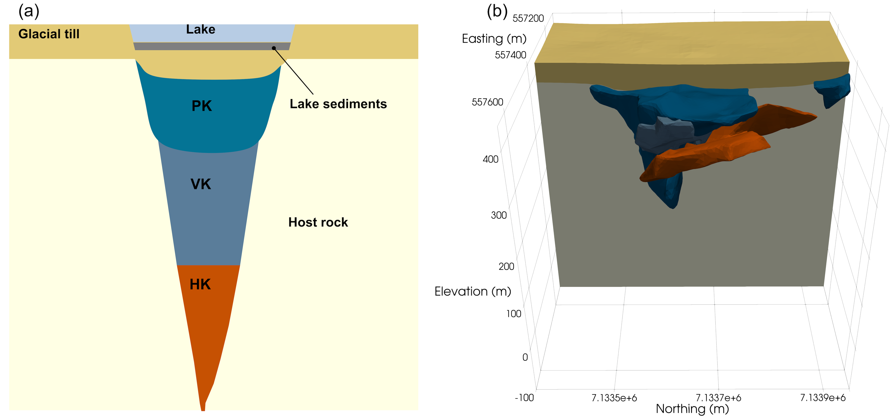

## Joint inversion of potential-fields data over the DO-27 kimberlite pipe using a Gaussian mixture model prior 

_Thibaut Astic, Dominique Fournier, and Douglas W. Oldenburg_

https://doi.org/10.1190/INT-2019-0283.1



## Summary

We have carried out petrophysically and geologically guided inversions (PGIs) to jointly invert airborne and ground-based gravity data and airborne magnetic data to recover a quasi-geology model of the DO-27 kimberlite pipe in the Tli Kwi Cho (also referred to as TKC) cluster. DO-27 is composed of three main kimberlite rock types in contact with each other and embedded in a granitic host rock covered by a thin layer of glacial till. The pyroclastic kimberlite (PK), which is diamondiferous, and the volcanoclastic kimberlite (VK) have anomalously low density, due to their high porosity, and weak magnetic susceptibility. They are indistinguishable from each other based upon their potential-field responses. The hypabyssal kimberlite (HK), which is not diamondiferous, has been identified as highly magnetic and remanent. Quantitative petrophysical signatures for each rock unit are obtained from sample measurements, such as the increasing density of the PK/VK unit with depth and the remanent magnetization of the HK unit, and are represented as a Gaussian mixture model (GMM). This GMM guides the PGI toward generating a 3D quasi-geology model with physical properties that satisfies the geophysical data sets and the petrophysical signatures. Density and magnetization models recovered individually yield volumes that have physical property combinations that do not conform to any known petrophysical characteristics of the rocks in the area. A multiphysics PGI addresses this problem by using the GMM as a coupling term, but it puts a volume of the PK/VK unit at a location that is incompatible with geologic information from drillholes. To conform to that geologic knowledge, a fourth unit is introduced, PK-minor, which is petrophysically and geographically distinct from the main PK/VK unit. This inversion produces a quasi-geology model that presents good structural locations of the diamondiferous PK unit and can be used to provide a resource estimate or decide the locations of future drillholes. 

## Citation

Thibaut Astic, Dominique Fournier, and Douglas W. Oldenburg, (2020), "Joint inversion of potential-fields data over the DO-27 kimberlite pipe using a Gaussian mixture model prior," Interpretation 8: SS47-SS62.
https://doi.org/10.1190/INT-2019-0283.1

```
@article{astic_inversion_2023,
title = {Joint inversion of potential-fields data over the DO-27 kimberlite pipe using a Gaussian mixture model prior},
journal = {The SEG Library},
volume = {8},
pages = {1N-T1095},
year = {2020},
issn = {2324-8866},
doi = {https://doi.org/10.1190/INT-2019-0283.1},
url = {https://library.seg.org/doi/abs/10.1190/int-2019-0283.1}
}
```
